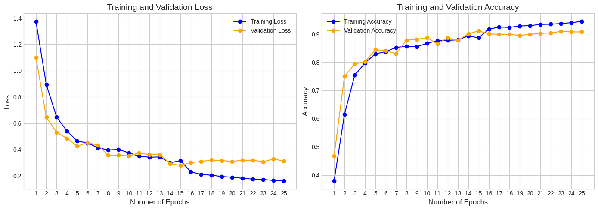

# noise-ViT

---

## Giới thiệu
Trong những năm gần đây, sự phát triển của các mô hình học sâu đã dẫn đến những bước tiến vượt bậc trong lĩnh vực thị giác máy tính. Một trong số đó là mô hình Vision Transformer (ViT), được phát triển dựa trên kiến trúc Transformer vốn nổi tiếng trong xử lý ngôn ngữ tự nhiên. Vision Transformer mang lại khả năng học toàn cục mạnh mẽ nhờ cơ chế self-attention, qua đó đạt được hiệu suất cao trên nhiều tác vụ, từ phân loại hình ảnh đến phân đoạn và phát hiện đối tượng. Trong bài báo này, chúng tôi đề xuất một phương pháp mới để cải thiện ViT bằng cách thêm nhiễu vào cơ chế attention và không làm tăng đáng kể lượng tham số tính toán của model. Ý tưởng này xuất phát từ việc sử dụng nhiễu như một kỹ thuật regularization nhằm giảm overfitting và tăng khả năng học các đặc trưng quan trọng từ dữ liệu.

---

## Ý tưởng
Nghiên cứu vẫn sử dụng kiến trúc của Transformer Encoder và thực hiện thay đổi trên cơ chế Multi-Head Attention:

---

<image src="images/ViT_architecture.png" width="672.5" height="400">

  <b>Hình 1:</b> Kiến trúc chung của ViT

---

<image src="images/NoiseMulti-HeadAttention.jpg">

  <b>Hình 2:</b> Kiến trúc của Transformer Encoder

---

<image src="images/Detail-Noise-MHA.png" width="472.5" height="478">

  <b>Hình 3:</b> Kiến trúc của Noise Multi-Head Attention

---

## Noise Multi-Head Attention

---

Cho Tensor đầu vào $x$, quá trình thêm nhiễu sau $n$ lần được mô tả bởi:

$$ x_{\text{output}} = x + \sum_{i=1}^{n} \left( \mathbf{W}_i \odot \mathbf{N}_i \right) \qquad (1) $$ 

Trong đó:
  
$$ \text{Mỗi } \mathbf{W}_i \text{ được khởi tạo từ phân phối chuẩn } \mathcal{N}(0, 1) \text{ và có thể huấn luyện được.} $$
$$ \text{Mỗi } \mathbf{N}_i \text{ được khởi tạo từ phân phối chuẩn } \mathcal{N} \left( 0, \frac{1}{n} \right) \text{ và không huấn luyện được.} $$

Tại mỗi lần lặp $i$:

$$ x \leftarrow x + \left( \mathbf{W_i} \odot \mathbf{N_i} \right) $$

Kết quả cuối cùng sau $n$ vòng lặp chính là $x_{output}$

$\rightarrow$ Nhiễu được thêm vào có tính chất ngẫu nhiên, phụ thuộc vào $W_{i}$ và $N_{i}.$

$\rightarrow$ tăng số lần lặp $n$ sẽ làm giảm độ lớn của mỗi $N_{i}$ nhưng tăng độ phức tạp của nhiễu tổng hợp.

---

- Thực hiện thêm nhiễu cho $Q, K \text{ và } V$ theo công thức (1).

- Tiếp tục tính attention theo công thức sau:

$$ F_{attention}\left( Q, K, V \right) = softmax \left( \frac{Q K^{T}}{\sqrt{d_{model}}} \right) V \qquad (2) $$

- Thực hiện tính attention cho mỗi head được định nghĩa như sau:

$$ head_i = F_{attention}\left( Q W_{i}^{Q}, K W_{i}^{K}, V W_{i}^{V} \right) $$
$$ \text{Với: } W_{i}^{Q / K} \in \mathbb{R}^{E \times d_{k}} \qquad W_{i}^{V} \in \mathbb{R}^{E \times d_{v}} $$
$$ \text{Trong đó: } E: \text{embedding dimension } (d_{model}), d_{k} \text{ và } d_{v} \text{ là "key dimendion" và "value dimension" cho mỗi head} $$

- Cuối cùng Noise Multi-Head Attention được tính như sau:

$$ NoiseMultiheadAttention = Concatenate\left( head_{i \rightarrow nheads } \right) \cdot W_{output} $$
$$ W_{output} \in \mathbb{R}^{(nheads \cdot d_{v}) \times d_{model} } $$

---

## Dữ liệu

--- 

[Brain Dataset](https://ieee-dataport.org/documents/brain-tumor-mri-dataset)

[Kidney Dataset](https://ieee-dataport.org/documents/kidney-tumor)

---

## Training Detail

---

Sử dụng 2 model có sử dụng Noise Multi-Head Attention và Multi-Head Attention tiêu chuẩn để huấn luyện trên 2 tập dữ liệu y tế về não và thận:

#### Brain Dataset

---

Số lượng ảnh dùng để huấn luyện 
- Training: 5712
- Validation: 571
- Testing: 1311

Huấn luyện với 25 epochs, sử dụng L4GPU

---

#### Kidney Dataset

---

Số lượng ảnh dùng để huấn luyện 
- Training: 9957
- Validation: 2489

Huấn luyện với 15 epochs, sử dụng L4GPU

---

## Kết quả

---

#### ViT Brain Dataset

---

#### Noise ViT Brain Dataset

---

#### ViT Kidney

---

#### Noise ViT Kidney Dataset

#### Bảng so sánh

$\rightarrow$ Trên Brain Dataset việc thêm nhiễu giúp model tăng độ chính xác trên dữ liệu test.

$\rightarrow$ Trên Kidney Dataset cả hai model đều hội tụ với accuracy cao trên dữ liệu kiểm tra, nhưng model với nhiễu cho kết quả cao hơn một chút và hội tụ nhanh hơn.

$\rightarrow$ Mặc dù số lượng tham số của model có nhiễu cao hơn nhưng việc huấn luyện có xu hướng nhanh hơn.
